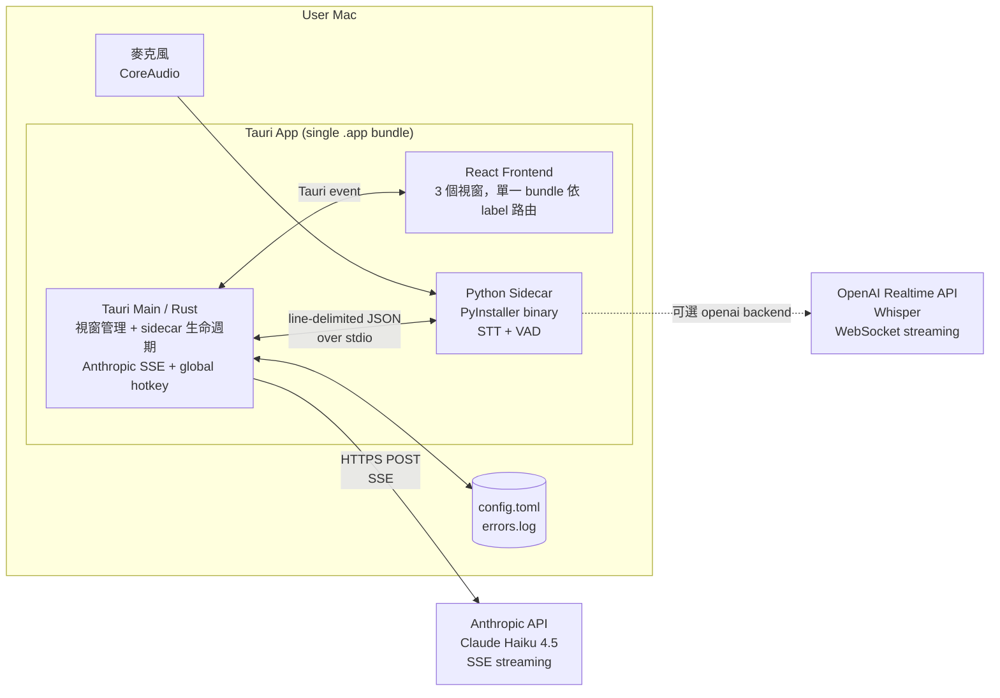
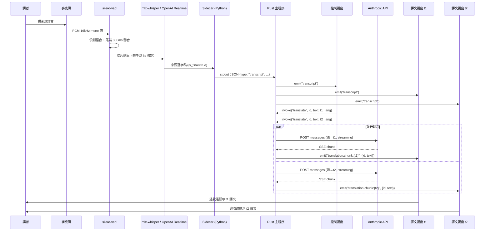
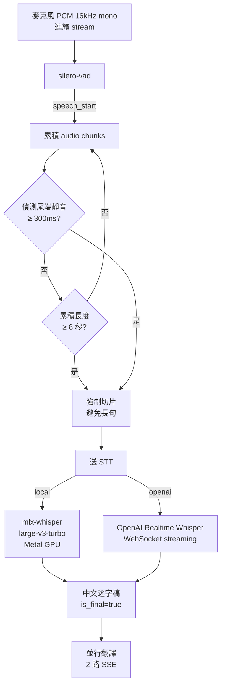
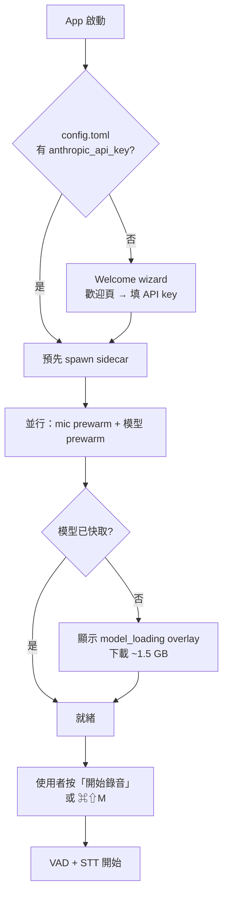
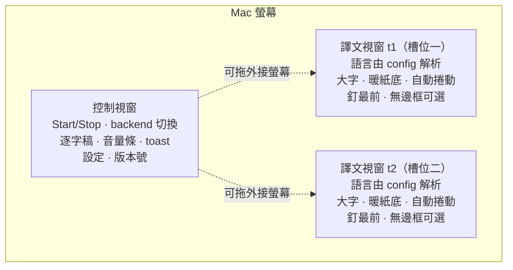
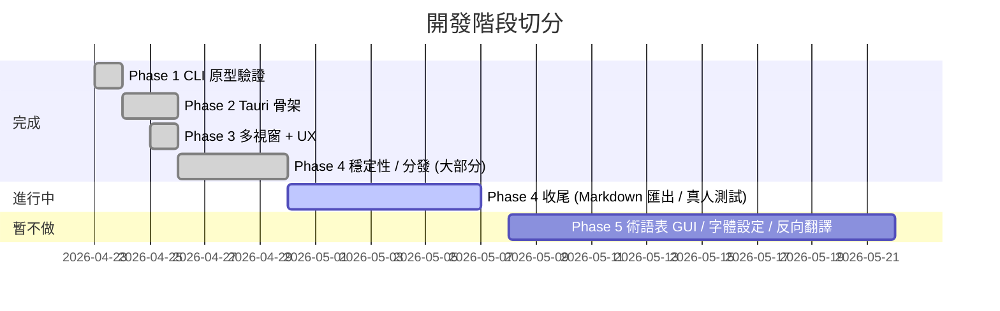

# MeetingCast 系統架構與資料流程

> 即時將會議報告轉寫並並行翻譯到兩個可配置的譯文槽位視窗，分顯示於三個獨立視窗（主控 + 譯文槽位 t1 / t2）。源語言與兩個目標語言皆可選（zh/en/ja/vi 互選），由 `shared/languages.json` 登錄表驅動。單場單向，不處理對方發言。

---

## 1. 整體架構



三個進程：
- **Tauri Main (Rust)**：視窗管理、sidecar 生命週期 + crash watchdog、Anthropic API 呼叫、全域 hotkey、設定 / 錯誤 log 讀寫
- **React Frontend**：單一 bundle 依 `getCurrentWindow().label`（`control` / `t1` / `t2`）決定 render 控制或譯文視窗；譯文視窗顯示的語言由 config runtime 解析（不綁 label）
- **Python Sidecar**：常駐 daemon，從 stdin 收命令、stdout 吐 line-delimited JSON 事件，內含 VAD + STT 雙 backend

---

## 2. 資料流：從說話到譯文



---

## 3. 技術選型與決策

| 層 | 選擇 | 替代 | 理由 |
|---|---|---|---|
| 桌面框架 | **Tauri 2.x** | Electron | 安裝包 ~1/3、記憶體低、Rust 後端穩定 |
| 前端 | **React 19 + TS + Tailwind v4** | Vue / Svelte | 團隊熟悉度、生態最大 |
| STT (本地) | **mlx-whisper** | faster-whisper, whisper.cpp | macOS Metal GPU 加速；ctranslate2 在 macOS 沒 Metal、CPU 4.3s 太慢 |
| STT (雲端) | **OpenAI Realtime Whisper** | Deepgram nova-3, Google Chirp 2, Azure | 邊講邊出字（live captioning）、技術詞彙準確；Deepgram 已於 0.1.20 後移除 |
| VAD | **silero-vad** | webrtcvad | 中文友善、ONNX 輕量 |
| 翻譯 LLM | **Claude Haiku 4.5** | Sonnet, GPT-4o | 首 token ~800ms、三語品質好、prompt caching 省 token |
| 跨進程通訊 | **line-delimited JSON over stdio** | WebSocket, gRPC, JSON-RPC | 簡單可靠、無需額外服務 |
| 全域熱鍵 | **tauri-plugin-global-shortcut** | — | 視窗失焦也能用 ⌘⇧M |
| 多視窗 | **Tauri WebviewWindow API** | — | 原生多視窗、可拖外接螢幕 |
| Sidecar 打包 | **PyInstaller** | py2app, Nuitka | 生態最成熟、PyInstaller --onefile 單檔分發 |

**為什麼不用 Electron**：安裝包大三倍、記憶體吃重，會議工具長時間開著體驗差。
**為什麼 Whisper 要用 Python sidecar 而非 Rust binding**：mlx-whisper 生態最成熟、Mac Metal 加速最穩定（透過 Apple MLX 框架）；Rust 端 whisper.cpp binding 仍有相容性問題。

---

## 4. 切片：VAD → STT → 翻譯



**切句策略**：
- 自然切：句子結束（尾端靜音 ≥ 300ms）→ 自然斷句，譯文穩定
- 強制切：單句連續超過 8 秒 → 避免長句譯文太晚出
- 兩種都會帶 `t_start` 作為 utterance id，**並行翻譯時防止 chunk 在 UI 交錯**

**翻譯策略**：
- MVP 採**句子級翻譯**：以 VAD 切出的完整句子為單位送翻譯。譯文穩定不跳動，聽眾體驗好
- Phase 2 可選**滾動式**：講話超過 8 秒未停頓時強制切片，需要處理「譯文覆蓋更新」的 UX

---

## 5. 翻譯 Prompt 結構

System + user 結構，system 部分用 **prompt caching** 鎖住術語表與風格，每次 API call 只重送中文逐字稿即可。

```
System (cached):
  你是專業即時會議口譯員。將使用者輸入的{source_lang}翻譯為 {lang}。（{source_lang}/{lang} 由 registry 依 config 替換）
  規則：
  1. 只輸出譯文，不要任何解釋、引號、標點修飾
  2. 保留專有名詞原文（公司名、產品名、人名）
  3. 口語化但專業，符合會議場合
  4. 若輸入是不完整片段，仍盡力翻譯，不要回問

  術語表：
  - {使用者自訂}（Phase 5）

User: {來源逐字稿}
```

省 token：system 約 ~150 token、cache 命中時省下整段，只計 user 端的中文逐字稿（通常 < 50 token）。

---

## 6. 延遲優化

| 階段 | 優化 |
|---|---|
| **VAD 切片** | `min_silence_ms=300` 較短，`max_speech_sec=8` 限制長句 |
| **STT 模型載入** | App 啟動時 sidecar prewarm（`model_loading` 事件給 UI 顯示「準備中」），避免使用者第一次按錄音卡 1–2 分鐘 |
| **麥克風權限** | 啟動時提前 getUserMedia（macOS 一次性授權 sidecar 子程序繼承），不打斷錄音 |
| **Sidecar spawn** | App 啟動時預先 spawn，amortize PyInstaller ~2s cold start |
| **Whisper 推論** | 用 `large-v3-turbo`（vs `large-v3` 4× 快、品質持平） |
| **翻譯首 token** | Haiku 4.5（vs Sonnet 約 2× 快） |
| **Prompt caching** | system 部分快取，僅重送 user 中文逐字稿 |
| **Streaming SSE** | Anthropic 一回 chunk 立即 emit，UI 邊收邊顯示，不等整段譯文 |
| **並行翻譯** | 中→英 / 中→越 同時送出（兩個 invoke 並行） |
| **Utterance id** | 譯文 chunk 帶 id，UI 端依 id 對齊；並行翻譯不會交錯 |
| **VAD cuts** | 後期針對切點調過 VAD 參數，降感知延遲 ~200ms |

實測：感知延遲 P50 ~2.3s ✅、P95 ~3.1s ⚠️（詳見 `docs/LATENCY.md`）。

---

## 7. 穩定性與容錯

| 機制 | 說明 |
|---|---|
| **Sidecar crash watchdog** | Python 子程序異常結束 → emit `stt:crashed` → 2s backoff 重啟 → re-issue last_start → emit `stt:restored`。3 次失敗 emit `stt:fatal`，前端 toast 通知 |
| **stderr 紀錄** | sidecar crash 時 stderr 最後 50 行寫進 `errors.log` |
| **錯誤 log** | JSON-lines append-only `errors.log`，每行 `{timestamp, category, message, context}`。記錄 sidecar crash / API error / config save fail |
| **Whisper hallucination 三層防禦** | 1) 低能量靜音直接跳過（避免「請按讚訂閱」訓練資料外洩）2) 重複片語過濾 3) prompt 強化要求 STT 不胡編 |
| **翻譯 meta-response 過濾** | LLM 偶爾回覆「我已將...翻譯為...」之類非譯文，translator.rs 用正則過濾（commit fdd750c 加寬 scan-and-match） |
| **設定持久化** | config.toml 即時 save，dev fallback 從 `prototype/.env` seed |
| **API key 載入順序** | 1) 讀 config.toml 2) 為空時 dev 模式 fallback 從 `prototype/.env` seed 3) Settings UI 改值 persist 回 config.toml |
| **React StrictMode 友善** | listener 用 promise-based cleanup，避免 double-mount 留下重複訂閱 |

---

## 8. 第一次啟動體驗（First-run UX）



關鍵設計：
- **Welcome wizard**：第一次啟動引導填 API key，Anthropic 必填
- **Prewarm overlay**：三步驟（啟動子程序 / 載模型 / 初始化麥克風），全部 done 才解鎖按鈕；UI 直接告訴使用者「首次啟動需下載 ~1.5 GB」
- **延遲麥克風授權**：getUserMedia 在 App 啟動時就觸發，使用者不會在第一次按錄音時被授權框打斷
- **Cache hit 不閃爍**：模型載入 overlay 延遲 400ms 才繪，cache 命中時根本不會閃出來

---

## 9. 視窗角色



- **控制視窗**：講者主操作，逐字稿即時顯示、MicMeter 10 段 VU 音量條、重新錄音時警告會清除舊紀錄
- **譯文視窗**（槽位 t1 / t2 各一，各自顯示所選目標語言，slot 可設「不使用」關閉）：可獨立拖到外接螢幕／投影給外籍同仁看；最近 5 句由亮到暗漸層、再往前 30% 透明度但仍可讀；可釘最前、無邊框（投影機友善）

---

## 10. 設計規範

### 色彩
所有 UI 走 `App.css` 的 `@theme paper-*` token（warm paper / 墨色），狀態色都收斂進暖色家族（`danger-*` / `warn-*` / `recording`）。**不在元件寫 hex 硬編碼**。

### 命名空間
- Tauri event：`transcript` / `stt:*` / `translation:chunk:<lang>` / `translation:done:<lang>` / `session:reset` / `hotkey:toggle`
- Sidecar 命令：`start` / `stop` / `shutdown`
- Sidecar 事件：`ready` / `started` / `transcript` / `stopped` / `error` / `prewarm` / `model_loading` / `model_ready`

### 設定檔
`~/Library/Application Support/MeetingCast/config.toml`
- `[api]` ✅ Settings UI 可改
- `[stt]` / `[vad]` / `[ui]` / `[glossary]` ⬜ Phase 5：目前 hardcoded，schema 已預留

---

## 11. 關鍵指標

| 指標 | 目標 | 實測 P50 / P95 | 狀態 |
|---|---|---|---|
| 感知延遲（說話結束 → 譯文首 token） | < 2.5 s | 2.3 / 3.1 s | ✅ / ⚠️ |
| 模型 cold start | < 3 s | TBD | ⬜ |
| Sidecar 重啟率 | 0 / 30min | TBD | ⬜ |

詳見 `docs/LATENCY.md`。

---

## 12. 開發階段


